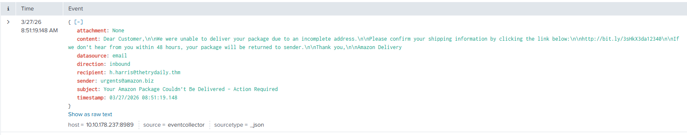
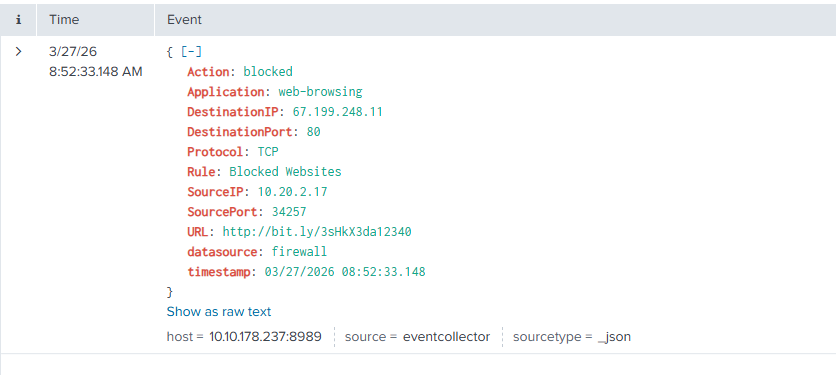
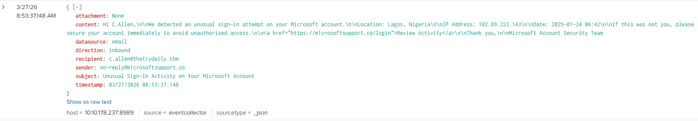

# Splunk Queries – SOC Simulator

Este archivo contiene las queries de Splunk utilizadas para verificar la interacción de los usuarios con los correos de phishing, así como las capturas de pantalla de los resultados.

---

## Alerta 8815 – Phishing (Amazon Spoofing)
**Query de Splunk:**
```splunk
index="main" sender="urgents@amazon.biz" recipient="h.harris@thetrydaily.thm"
````



## Alerta 8816 – Intento de Conexión (Bloqueado)
**Query de Splunk:**
```splunk
index="main" SourceIP="10.20.2.17" DestinationIP="67.199.248.11"
````



## Alerta 8817 – Phishing (Typosquatting Microsoft)
**Query de Splunk:**
```splunk
index="main" sender="no-reply@m1crosoftsupport.co" recipient="c.allen@thetrydaily.thm"
````



