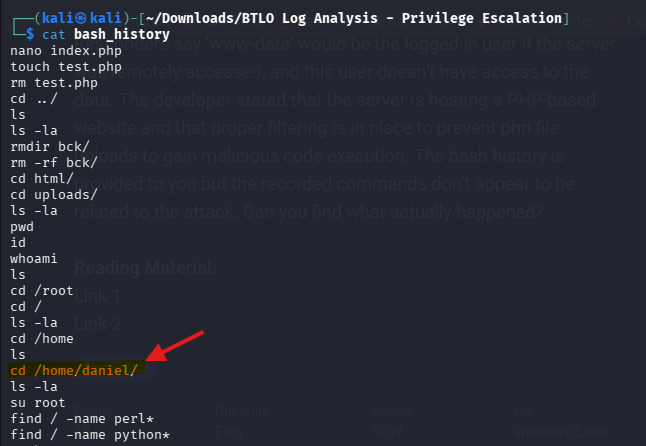
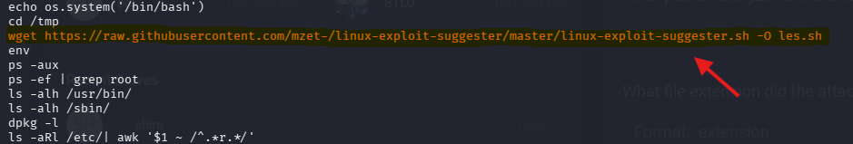
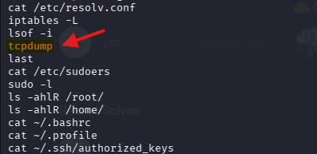
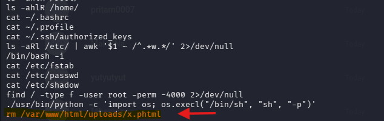
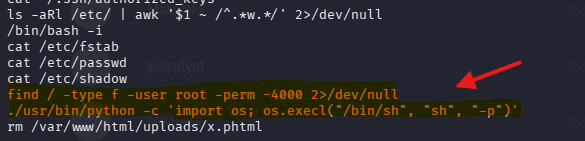

# BTLO Write-up: Log Analysis - Privilege Escalation

Este repositorio contiene el análisis y la resolución del reto "Log Analysis - Privilege Escalation" de Blue Team Labs Online. El objetivo es reconstruir un ataque de escalada de privilegios analizando el historial de comandos (`.bash_history`) de un servidor comprometido.

---

## Escenario
Un servidor con datos sensibles fue comprometido y la información se filtró en un foro. Aunque el acceso inicial fue mediante el usuario de bajos privilegios `www-data`, el atacante logró escalar a `root`. El desarrollador afirma que existen filtros para evitar la subida de archivos PHP maliciosos.

---

## Análisis de la Intrusión

### 1. Enumeración de Usuarios
Al inspeccionar el historial, se observa que el atacante lista los directorios dentro de `/home` para identificar usuarios válidos en el sistema.

* **Pregunta:** ¿Qué usuario (además de 'root') está presente en el servidor?
* **Respuesta:** daniel

---

### 2. Herramientas de Post-Explotación
El atacante utiliza `wget` para descargar un script de enumeración automática desde un repositorio de GitHub. Este script busca debilidades en el kernel y servicios mal configurados.

* **Pregunta:** ¿Qué script intentó descargar el atacante al servidor?
* **Respuesta:** linux-exploit-suggester.sh

---

### 3. Reconocimiento de Red
Se identifica un intento de utilizar un analizador de paquetes para interceptar tráfico, una actividad orientada a obtener credenciales de otros servicios activos en la red interna.

* **Pregunta:** ¿Qué herramienta de análisis de paquetes intentó usar el atacante?
* **Respuesta:** tcpdump

---

### 4. Evasión de Filtros (Upload Bypass)
A pesar de las restricciones sobre archivos `.php`, el atacante logró ejecutar código PHP utilizando la extensión `.phtml`, la cual suele ser procesada por el servidor web como código ejecutable si no está correctamente restringida.

* **Pregunta:** ¿Qué extensión de archivo usó el atacante para evadir el filtro de subida?
* **Respuesta:** .phtml

---

### 5. Escalada de Privilegios (SUID Exploitation)
El atacante buscó archivos con el bit SUID (Set User ID) activo. Identificó que el binario de Python tenía este permiso, lo que permite ejecutar comandos con los privilegios del propietario (root).

* **Pregunta:** ¿Qué misconfiguración fue explotada en el binario ‘python’ para ganar acceso de root?
* **Respuesta:** 4 - SUID

---

## Conclusión y Mitigación
1. **Validación de archivos:** Los filtros basados en listas negras son insuficientes. Se debe implementar una lista blanca de extensiones permitidas y verificar el tipo de contenido (MIME type).
2. **Hardening del sistema:** No se debe asignar el bit SUID a intérpretes de comandos o lenguajes de programación como Python o Perl, ya que facilitan la obtención de una shell de root.
3. **Monitorización:** La auditoría de archivos de historial y el uso de herramientas como Auditd son fundamentales para detectar movimientos sospechosos en tiempo real.
