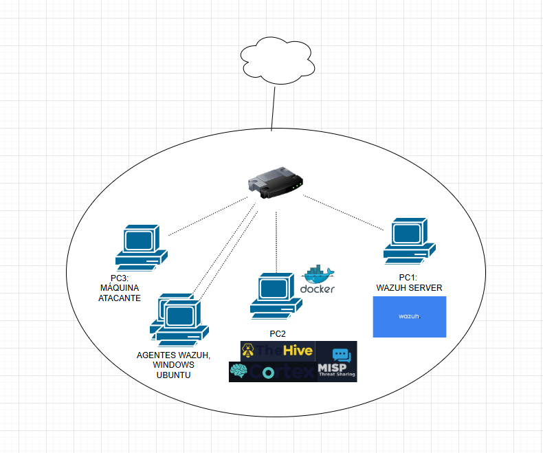

# 🛡️ Home Lab SOC — Entorno de Detección y Respuesta a Incidentes

## 📋 Descripción

Este proyecto consiste en la construcción de un **laboratorio SOC doméstico** sobre máquinas virtuales (VirtualBox) en un host Windows físico. El objetivo es simular un entorno real de operaciones de seguridad que permita:

- Detectar y analizar ataques mediante un SIEM (Wazuh)
- Gestionar incidentes con una plataforma SOAR (TheHive + Cortex)
- Compartir inteligencia de amenazas (MISP)
- Ejecutar ataques controlados desde una máquina atacante para validar las detecciones

Este laboratorio sirve como entorno de práctica para consolidar habilidades en **Blue Team**

---

## 🗺️ Arquitectura

```
[Internet / Nube]
        |
    [Switch/Router virtual]
     /      |       \        \
  [PC1]   [PC2]   [PC3]   [Agentes Wazuh]
 Wazuh   Docker  Máquina   Windows + Ubuntu
 Server  Stack   Atacante
```



---

## 🖥️ Componentes del Laboratorio

| Máquina | Rol | SO | Herramientas |
|---|---|---|---|
| **PC1** | Wazuh Server | Ubuntu Server | Wazuh Manager, Wazuh Dashboard |
| **PC2** | Stack de respuesta | Ubuntu Server | Docker, TheHive, Cortex, MISP |
| **PC3** | Máquina atacante | Kali Linux | Nmap, Metasploit, herramientas ofensivas |
| **Agente Windows** | Endpoint monitorizado | Windows 10/11 | Wazuh Agent |
| **Agente Ubuntu** | Endpoint monitorizado | Ubuntu Desktop | Wazuh Agent |
| **Host físico** | Anfitrión / hipervisor | Windows | VirtualBox |

---

## 🛠️ Stack Tecnológico

### SIEM — Wazuh
- Recolección y correlación de logs de los agentes
- Detección de amenazas basada en reglas
- Dashboard de visualización de alertas

### SOAR — TheHive + Cortex
- **TheHive**: Gestión de casos e incidentes
- **Cortex**: Análisis automatizado de observables (IPs, hashes, dominios)

### Threat Intelligence — MISP
- Plataforma de compartición de indicadores de compromiso (IOCs)
- Integración con TheHive para enriquecer los casos

### Infraestructura
- **VirtualBox** como hipervisor sobre host Windows
- **Docker** en PC2 para orquestar TheHive, Cortex y MISP
- Red interna virtual entre todas las máquinas

---

## 📁 Estructura del Proyecto

```
03-HomeLab-SOC/
├── images/
│   └── Diagrama_ProyectoHomeSoc.png
├── README_es.md
├── README_en.md
├── 01-wazuh-setup.md          # Instalación y configuración de Wazuh
├── 02-thehive-cortex-misp.md  # Despliegue del stack Docker
├── 03-agents-setup.md         # Configuración de agentes Wazuh
├── 04-attack-simulations.md   # Simulaciones de ataques y detecciones
└── splunk_queries.md          # (Opcional) Consultas adicionales
```

---

## 🎯 Objetivos del Laboratorio

- [x] Despliegue y configuración de Wazuh Server
- [x] Instalación de agentes en Windows y Ubuntu
- [x] Despliegue de TheHive, Cortex y MISP con Docker
- [ ] Simulación de ataques y validación de alertas
- [ ] Creación de casos de incidente en TheHive
- [ ] Integración MISP → TheHive para enriquecimiento de IOCs


